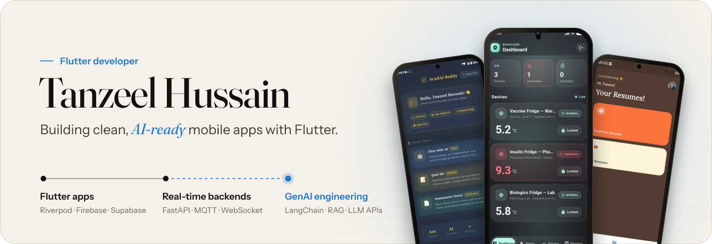
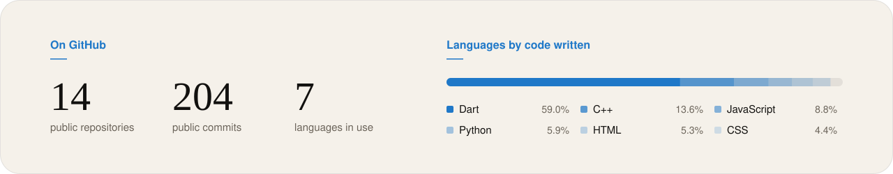

<picture>
  <source media="(prefers-color-scheme: dark)" srcset="assets/readme/banner-dark.svg">
  
</picture>

[Résumé (PDF)](https://f243077-cell.github.io/f243077-cell/assets/Tanzeel_Hussain_Resume.pdf) · [LinkedIn](https://linkedin.com/in/tanzeel-hussain-176a93327/) · [Email](mailto:tanzeelhussain346@gmail.com)

## About me

I'm a Software Engineering student at FAST-NUCES Faisalabad who builds Flutter apps end to end: Riverpod state, Clean Architecture layers, and a real backend behind the UI, whether that's Firebase, Supabase, or a FastAPI service I wrote myself. In August 2026 I finished an eight-week remote Flutter internship at FlutterCraft.app, and I take freelance Flutter work on Fiverr alongside my degree. My last three builds each put something smarter than a CRUD API behind the screen: an LLM study companion, an LLM resume generator whose API key never leaves a Supabase Edge Function, and an MQTT-fed cold-chain monitor. That's the direction I'm heading, GenAI engineering (RAG, LangChain, agent orchestration) on top of a solid mobile foundation. I'm open to Flutter and AI-engineering roles, remote or on-site, in Pakistan, Dubai, and Germany.

### Career snapshot

| Role                        | Organization               | When                      |
| :-------------------------- | :------------------------- | :------------------------ |
| Flutter Developer Intern    | FlutterCraft.app (remote)  | Jul – Aug 2026, completed |
| Freelance Flutter Developer | Fiverr                     | Ongoing                   |
| BS Software Engineering     | FAST-NUCES Faisalabad      | 2024 – 2028               |

## Featured projects

### [BioGuard](https://github.com/f243077-cell/BioGuard): cold-chain compliance for vaccines, insulin and biologics

Simulated fridge sensors publish temperature and lock readings over MQTT (QoS 1, persistent broker) to a FastAPI backend, which re-checks every reading against *that device's own* thresholds, ignoring the sensor's self-reported anomaly flag and any device ID in the payload, before opening, escalating or resolving an alert. A drift more than 5 °C past the safe range escalates the same alert from warning to critical, which is what sounds the Flutter app's alarm; alerts are pushed live over WebSocket and Firebase Cloud Messaging, while the device dashboard deliberately polls every 5 s, because a slightly stale temperature is fine but a late alarm isn't. The Flutter app (Riverpod, JWT login/register/logout) covers a live multi-device dashboard, a history screen with trend charts, persistent alert history, and PDF compliance reports, and the backend runs SQLite in WAL mode so API reads never hit "database is locked" while the MQTT thread is writing.

FastAPI · Flutter · Riverpod · MQTT (Mosquitto) · WebSocket · Firebase Cloud Messaging · SQLite · Docker Compose

### [AcadAI Buddy](https://github.com/f243077-cell/AcadAi_Buddy): AI study companion for university students

Subject-aware AI chat, MCQ quizzes that are generated and scored on the spot, and bullet-point summaries from pasted text or a photo of your notes, across 40+ subjects including every FAST-NUCES core course, plus custom subjects. The app is split into four Clean Architecture layers (presentation, Riverpod application, domain, infrastructure), with Firebase and OpenRouter confined to the infrastructure layer behind abstract repositories and failures returned as `dartz` `Either` values instead of thrown exceptions, so the UI never knows which model provider it's talking to. Chat history persists per user in Firestore.

Flutter · Riverpod · Firebase Auth · Cloud Firestore · OpenRouter · go_router · Clean Architecture

### [CreateResume AI](https://github.com/f243077-cell/CreateResume-AI-App): plain-language input to ATS-ready resume

Describe your background in plain language and it drafts a full ATS-optimized resume (summary, experience, education, skills, projects), optionally tailored to a pasted job description, then renders it through a custom template engine on the `pdf` package into five layouts: Classic, Modern, Minimal, Executive and Executive 2. Generation runs server-side in a Supabase Edge Function that calls OpenRouter (Llama 3.3 70B), so the API key never ships inside the app, and each generation draws on a per-user credit balance stored in Postgres behind free and premium plans. Supabase stays behind domain interfaces (`IResumeRepository`, `IAuthRepository`), with a Riverpod notifier per feature module and a go_router shell route for persistent bottom navigation.

Flutter · Riverpod · Supabase (Auth, Postgres, Storage, Edge Functions) · OpenRouter · go_router

### [Console Chess Engine](https://github.com/f243077-cell/oop-chess-game): two-player chess in the terminal

Built around an abstract `Piece` base class: each of the six piece types overrides its own movement rules and is created through factory functions onto an 8×8 board of piece pointers. Move validation is layered (geometry, then path blocking, then a check test that rejects any move leaving your own king exposed), and that same check test is what drives checkmate and stalemate detection. Castling, en passant and promotion are the documented next step.

C++ · OOP · polymorphism · factory pattern

### [Console-Based Social Media Platform](https://github.com/f243077-cell/Mini_Instagram_App): a social network with no STL

A DSA course project with one hard rule: no STL containers, so every structure is hand-built with pointers. Each feature sits on the structure that fits its access pattern: a chained hash table for the user directory, an adjacency-list graph for friendships (BFS/DFS), doubly linked lists for feeds, a circular list for stories, a FIFO queue for notifications, stacks for message threads, and an AVL tree for top-K and range-query analytics. Deleting an account cascades through every module (friendships, posts, messages, rankings), so no structure is left pointing at a removed user. Built with Muhammad Hassan.

C++ · data structures · manual memory management

<b>More projects</b>

 

- [Discrete University Management System](https://github.com/f243077-cell/Discrete-University-Management-System): course scheduling and prerequisite validation using discrete math
- [FlexPortal](https://github.com/f243077-cell/FlexPortal-Student-Attendance-Result-Management-System): attendance and result management with role-based login
- [FounderAI](https://github.com/f243077-cell/Founder_AI): AI startup assistant, built at the GDG "Build with AI" hackathon
- [Weather App](https://github.com/f243077-cell/Weather_App): real-time weather with location-based lookup
- [Multi-Currency Converter](https://github.com/f243077-cell/flutter-multi-currency-converter): live PKR to 20+ currencies
- [University Management System](https://github.com/f243077-cell/fast-university-management-system)
- [Slot Booking System](https://github.com/f243077-cell/Slot-booking-system)
- [CSV Validator](https://github.com/f243077-cell/CSV-Validator)
- [Resume to JSON Extractor](https://github.com/f243077-cell/Resume-to-JSON-Extractor-)
- [URL Health Checker](https://github.com/f243077-cell/URL-Health-Checker)
- [whispr](https://github.com/f243077-cell/whispr)

## Tech stack

- **Mobile:** Flutter, Dart, Riverpod, Provider, Hive, Drift (SQLite), Platform Channels, iOS Live Activities, Android Foreground Services, flutter_local_notifications, Material Design, Animations
- **Architecture & design:** Clean Architecture, Layered Architecture, MVC, MVP, Repository Pattern, Feature-First Architecture, SOLID, GoF Design Patterns, OOP, UML
- **Backend & cloud:** Firebase Auth, Firestore, Firebase Realtime Database, Firestore Security Rules, REST APIs, Cloudflare Workers, Google Cloud Run, PostgreSQL, FastAPI
- **AI:** Antigravity, Cursor, Claude Code, Google Stitch, OpenRouter, Postman, LLMs, prompt engineering
- **Languages:** SQL, Dart, C++, Java, Python
- **Tools:** Git, GitHub, VS Code, Android Studio, Docker

## Learning roadmap

- [x] Python, NumPy, Pandas
- [x] Docker
- [x] MCP (Model Context Protocol) & prompt engineering
- [x] Software Design & Architecture (SDA)
- [ ] LLM orchestration & RAG (LangChain)
- [ ] Software Construction & Development (SCD)
- [ ] Vector databases
- [ ] MLOps
- [ ] Agentic AI systems

## Achievements

- GDG "Build with AI" hackathon participant: built [FounderAI](https://github.com/f243077-cell/Founder_AI), an AI startup assistant

## GitHub stats

<picture>
  <source media="(prefers-color-scheme: dark)" srcset="assets/readme/stats-dark.svg">
  
</picture>

Drawn daily by a GitHub Action in this repo. Language shares exclude build files and the platform-runner code Flutter generates.
